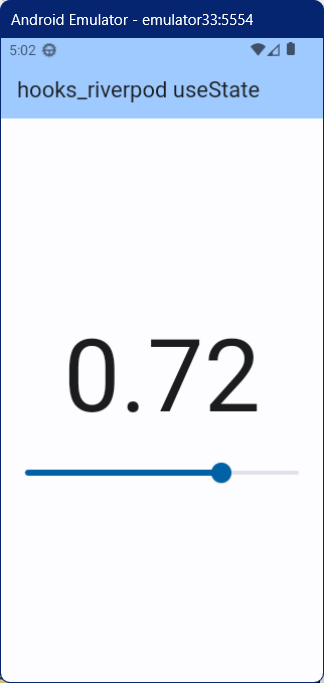

# hooks_riverpod with useState Demo

hooks_riverpod で useState を使ったデモ

### パッケージのインストール

flutter_riverpod と hooks_riverpod、そして flutter_hooks パッケージをインストールする

``` console
flutter pub add flutter_riverpod hooks_riverpod flutter_hooks
```

### 動作イメージ

シンプルなスライダーアプリ



### HookWidget と useState

useState を使うと StateNotifierProvider を使う必要がなくなり、実装がシンプルになる。

`sliderValue = useState<double>(0.5)` でスライダーの値を管理している。

値の取得は、`sliderValue.value` で行い、代入は、`sliderValue.value = value` のように行うことができる。

StatefulWidget で変数の変更を画面に反映させるためには、setState を使う必要がある。

しかし、useState を使うことで、setState を使う必要がなくなり、代入を行うだけでウィジェットの再描画がされるようになる。
